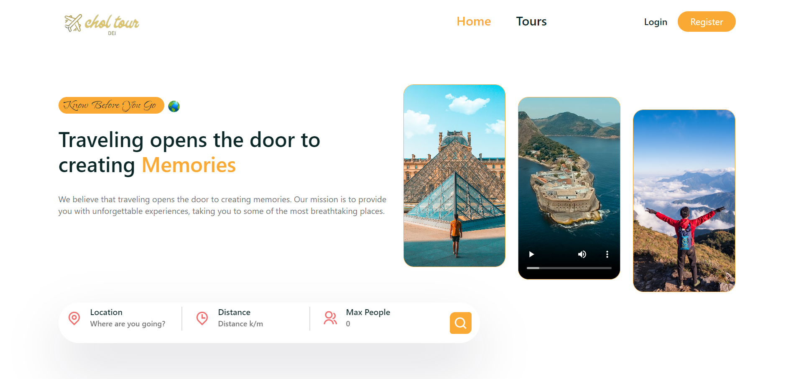
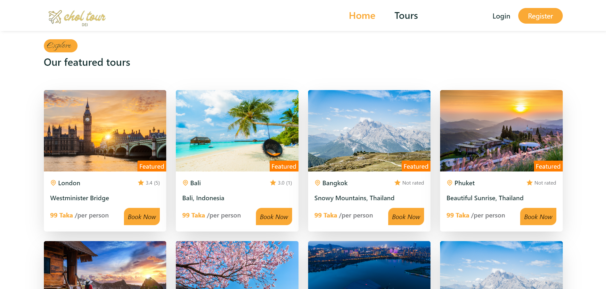
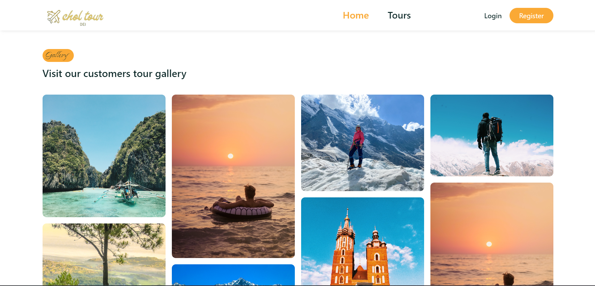
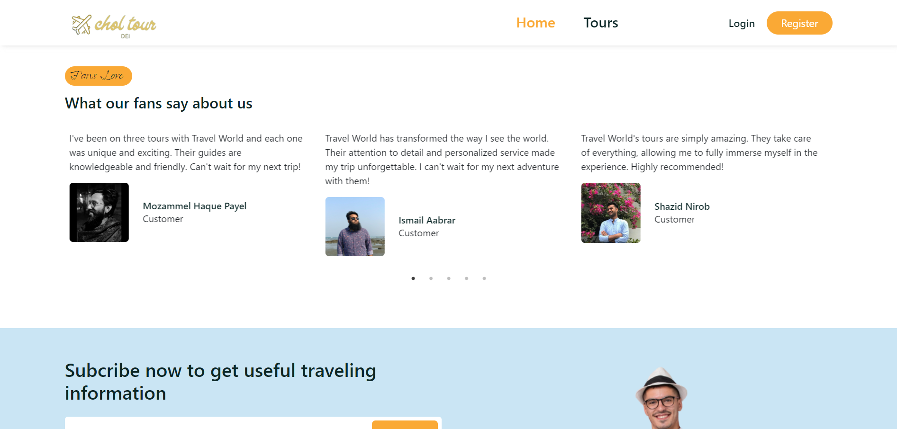
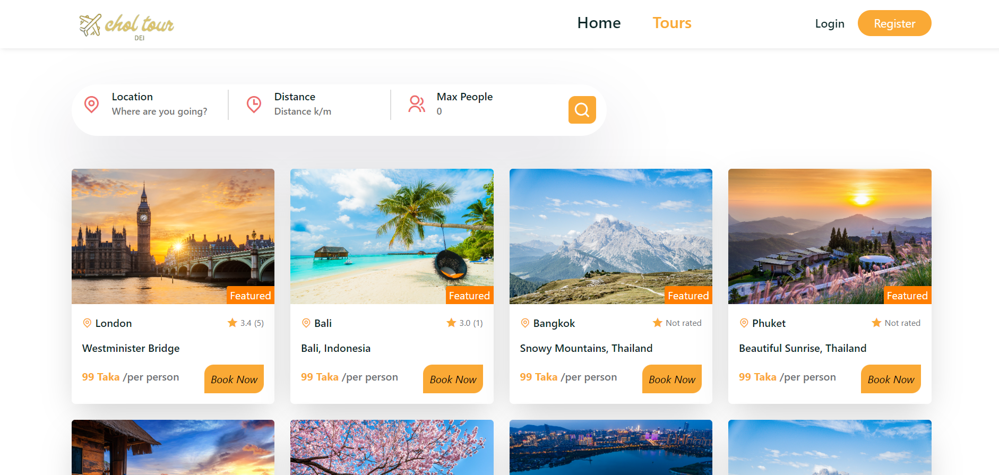
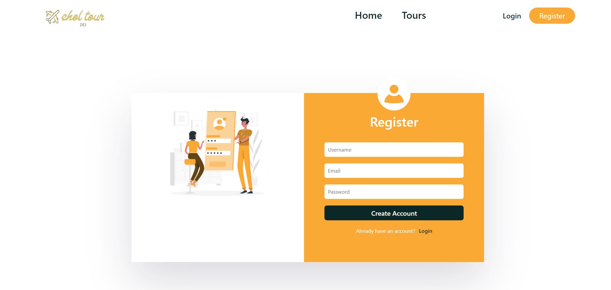
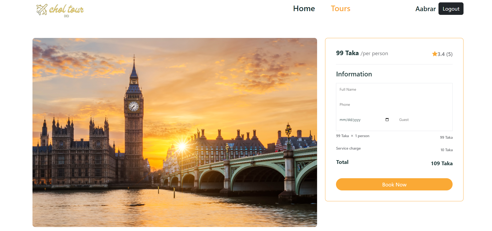
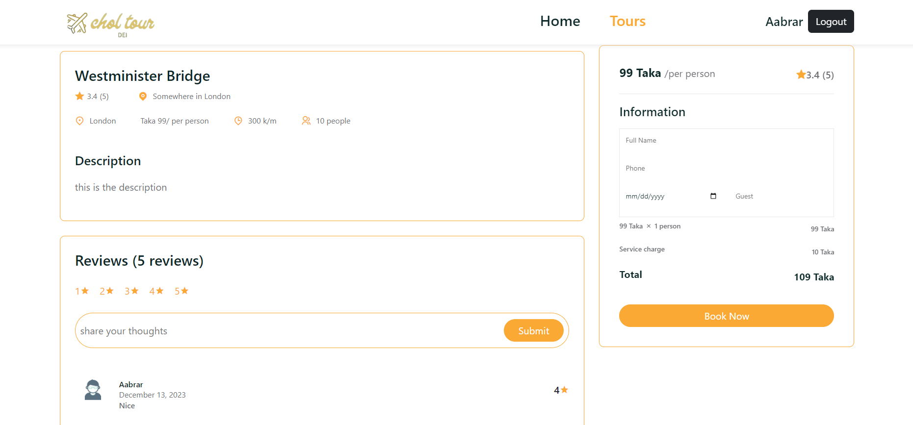

# Welcome to Software Engineering lab Project Documentation :octicons-heart-fill-24:{ .heart }

## We are Team Nexus :smile:

##In this Home page we will share our project features snapshots and explain each features.     

This is our landing page where there is a logo of our website in navbar there are four button 

Home, Tours,  Login & Register.     

Here user can explore our tour package and there are enough information about all package    

This is our Customers Tour Gallery section. Were we share some of our customers happy memory.    

Finally this is our fans comment section where fans share some valuable experience with us.    

This is our tour page where user can select their package also they can search their destination.    

This is our Login page if user want to buy any package user have to register and log in to our system.    

{

After login if user want to book any package this window will pop up where they can see the price of per person for the package they can increase person number and the price will automatically increase. Then they will click the book now button.
    

User who already use our package can give rating and review of there experience and submit. It wil automatically save to our database and user can explore this review before booking any package. 
    