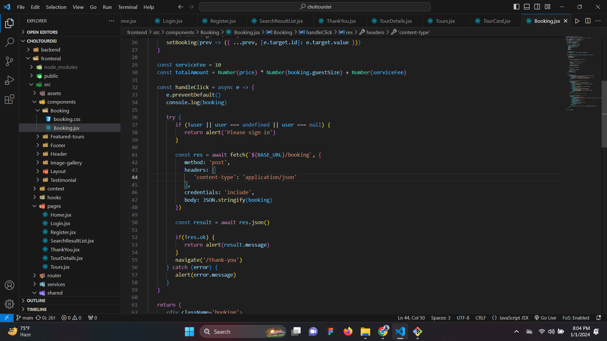
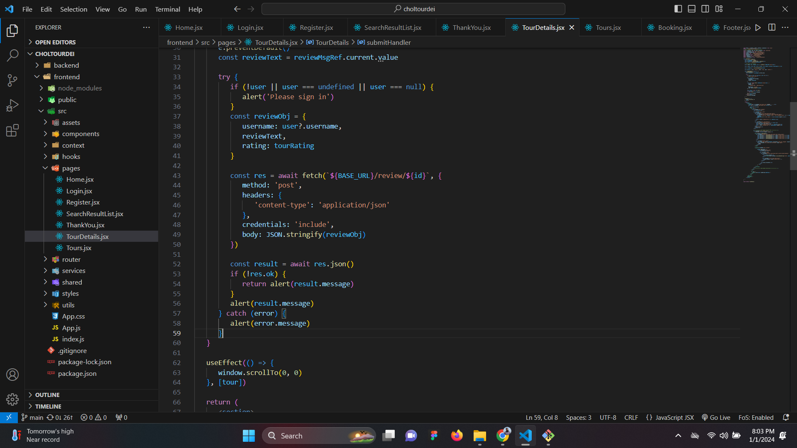
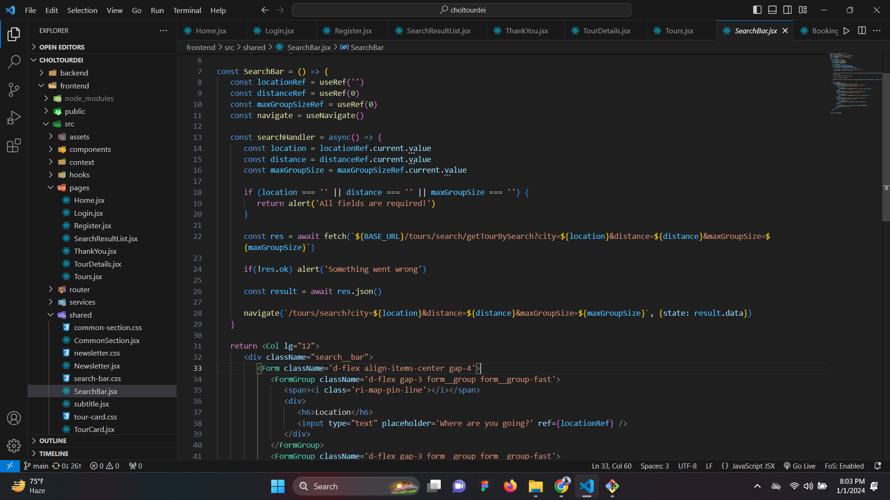

#Welcome To Our AJAX Documentation:octicons-heart-fill-24:{ .heart }

##This AJAX Documentation will help you to understand how we implement AJAX im this project.

- In this project we use Five AJAX implementation.

     * Login.
    * Register.
    * Bookings.
    * Search Bar
    * Tour Details.
    

##Login
 We implement Ajax to offer real-time authentication for the login process, which improves user experience and security by giving users instant feedback on whether their login credentials are correct.

    

##Register
 We implement Ajax to provide real-time validation, username/email availability checks, and instant error feedback in registration forms. These features streamline and improve the user experience during the registration process.

    

##Bookings 
In `booking.jsx`, AJAX (Asynchronous JavaScript and XML) is likely used to make your tour management website more dynamic and user-friendly. It helps in updating information, like availability and prices, without needing to reload the entire page. This makes the booking process smoother and more responsive for users, improving their overall experience on the website.

    

##Tour Details
 Without requiring a full page reload, Tour Details.jsx uses Ajax to obtain comprehensive information about a tour, including descriptions, reviews, and images. It improves the user experience by updating the content dynamically.

    

##Search Bar 
We implement AJAX in search components to retrieve search results

    

