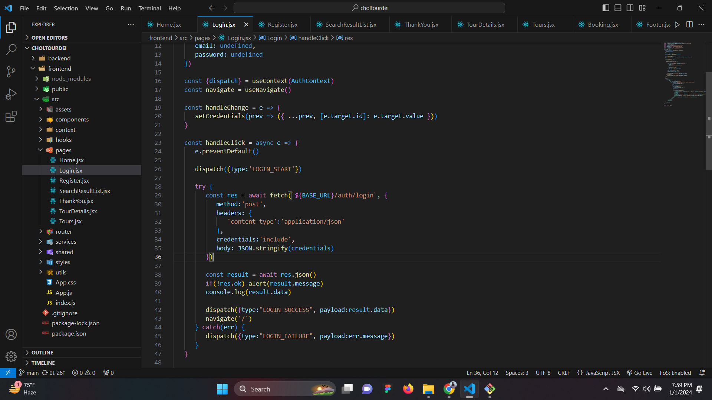
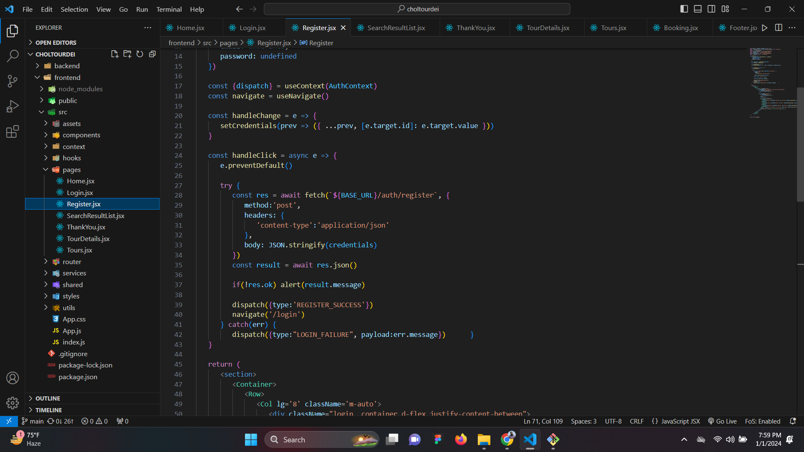

#Welcome To Our AJAX Documentation:octicons-heart-fill-24:{ .heart }

##This AJAX Documentation will help you to understand how we implement AJAX im this project.

- In this project we use Five AJAX implementation.

     * Login.
    * Register.
    * Bookings.
    * Search Bar
    * Tour Details.
    

Login: Ajax can be used to offer real-time authentication for the login process, which improves user experience and security by giving users instant feedback on whether their login credentials are correct.

Register: Ajax can be used to provide real-time validation, username/email availability checks, and instant error feedback in registration forms. These features streamline and improve the user experience during the registration process.

