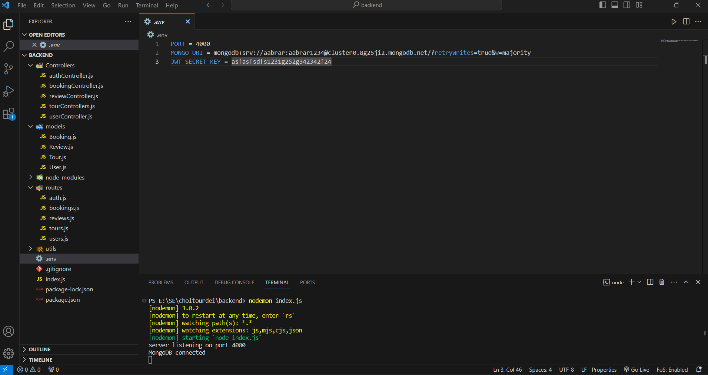

#Welcome To Our Project Coding Documentation:octicons-heart-fill-24:{ .heart }

##This Coding Documentation will help you to understand how we implement this project.

##Register Page

This code represent the frontend of register     

##Login Page

this is our login page front end where we use react for design and this is our code snapshots.    

in this code first we import modules and user modules then we create register functions after that we hash the password and create a new user instance than save it to database and generate token, response with user token, and error handling.
    

##Search Result

this part shows the search result.    

##Tour Page

Both this part represent Calculating Avg Rating,Tour review section, Review Header,Rating star, Review input and submit button    

##Home page
The below snapshot represent the Home page where user can explore our tour package and there are enough information about all package,Customers Tour Gallery section, Were we share some of our customers happy memory. fans comment section where fans share some valuable experience with us.    

    

##Footer

    

##Header
Here We can see navbar where 4 Buttons are available, Home,Tour,Login & Register    

##MongoDB

MongoDB is our database where we save our data and fetch data.    

here we set our MOngoDB environment with MONGO_URL    

Above snapshots in Test database there is four table bookings,reviews,tours & users.    

