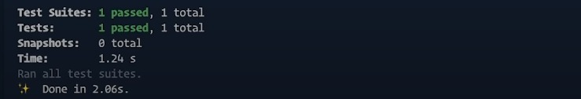

#Welcome To Our Unit-Testing Documentation:octicons-heart-fill-24:{ .heart }

##This Unit-Testing Documentation will help you to understand how we Test our every features in  project.

- In this project we use Five Unit-Testing.
     
    * Tour
    * User
    
     * Review   
    * Bookings
    * Thank you

#Tour Test

##Result
    

#User Test

##Result
    

#Review Test

##Result
    

#Bookings Test

##Result
    

#Thank you Test

##Result
    

