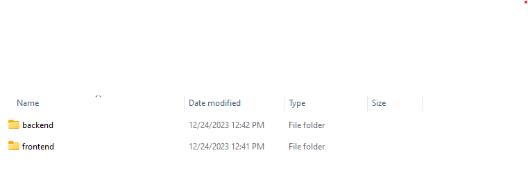
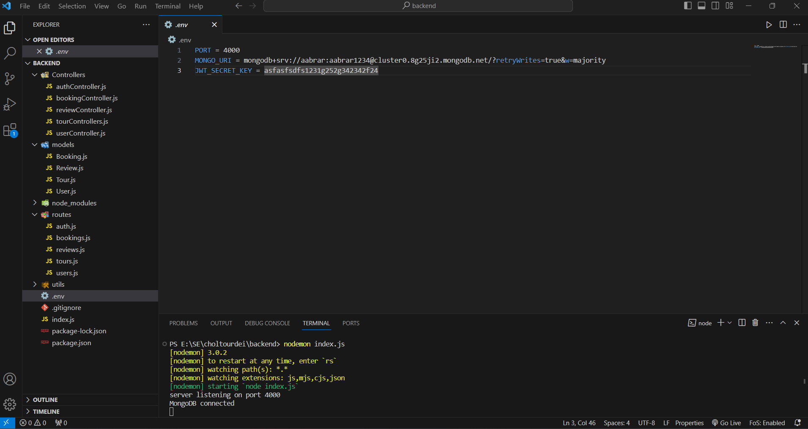

#Welcome to the Team Nexus project User Guide:octicons-heart-fill-24:{ .heart }
##This user guide will help you clone the project repository and run it in your own environment.<br><br><br><br>

To run this project first install node js in your computer.

Secondly you have to clone our code from github repository.  

There will be two folder one for frontend and second for backend. 
{width=100%}

Then move to frontend folder terminal  and enter command 1. ```npm install```  2. ```npm run start```

For backend move to the terminal and 1. ```npm install```  2. ```npm nodemon index.js```


Then you have to open your MongoDB and in ``.env``` file change MONGO_URL with your own MONGO_URL. <br><br><br><br>


{width=100%}
